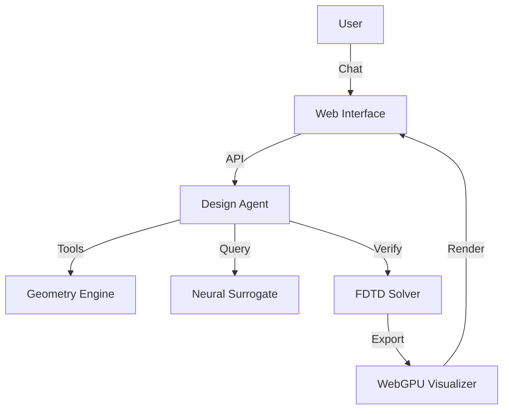

# ✨ PhotonicForge

**The Agentic AI Platform for Integrated Photonics.**

PhotonicForge is a vertically integrated design platform that automates the creation of photonic chips using AI. It combines differentiable physics simulation, neural surrogate models, and an LLM-driven agent into a unified "Visual Editor" for photonics.


## 🚀 Features

### 1. 🧠 Agentic Design (`photonic_forge.agent`)
- **Natural Language Design**: "Create a wavelength demultiplexer for 1550nm."
- **Tool Use**: The agent autonomously orchestrated geometry generation, simulation, and optimization.
- **Data Moat**: All interactions are logged to fine-tune future models.

### 2. ⚡ Differentiable Physics (`photonic_forge.core`, `photonic_forge.solvers`)
- **Signed Distance Fields (SDF)**: Resolution-independent geometry representation.
- **Meep & WebGPU**: Hybrid solving strategy for both high-fidelity verification and real-time visualization.
- **Yield Analysis**: Monte Carlo estimation of manufacturing robustness.

### 3. 🕸️ The Forge Web Interface (`photonic_forge.serv`)
- **Browser-Based**: No local installation required for end-users.
- **Real-Time FDTD**: WebGPU shaders render field propagation at 60fps in the browser.
- **Chat Interface**: Interactive design session with the AI Agent.

---

## 🛠️ Installation

```bash
# Clone the repository
git clone https://github.com/edwinsamuelojeda/photonic-forge.git
cd photonic-forge

# Create environment
python -m venv venv
.\venv\Scripts\activate

# Install dependencies
pip install -r requirements.txt
pip install -e .
```

## 🏁 Quick Start

### Launch the Web Prototype
Experience the "Hero Flow" — designing chips via chat.

```bash
python -m photonic_forge.serv.main
```
> Open **[http://localhost:8000](http://localhost:8000)** in your browser. (Chrome/Edge required for WebGPU)

### Run the Agent via CLI
```bash
python examples/08_natural_language_design.py
```

### Run Yield Optimization Demo
```bash
python examples/10_yield_optimization.py
```

---

## 📅 Development Roadmap (Completed)

| Week | Milestone | Status |
|------|-----------|:------:|
| 1-5  | **Core Foundation** (Geometry, FDTD, Optimization) | ✅ |
| 6    | **Neural Surrogates** (1000x faster simulation) | ✅ |
| 7    | **Agentic Interface** (LLM Tool Use) | ✅ |
| 8    | **WebGPU Visualization** (Browser Rendering) | ✅ |
| 9    | **Yield Optimization** (Manufacturing Constraints) | ✅ |
| 10   | **Web Prototype** (The "Forge" App) | ✅ |

---

## 🏗️ Architecture



## 📜 License
MIT License. Built for the **Bleeding Edge** of AI & Physics.
